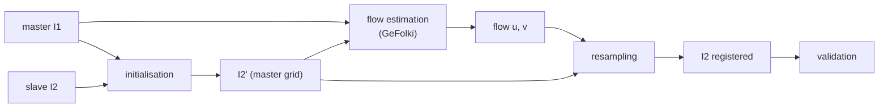
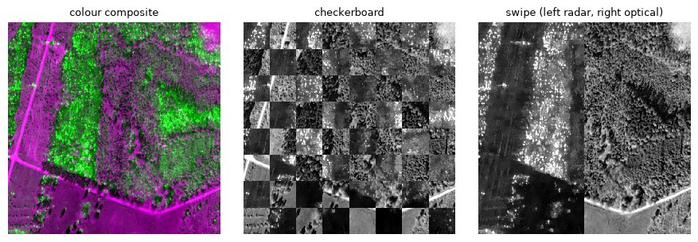
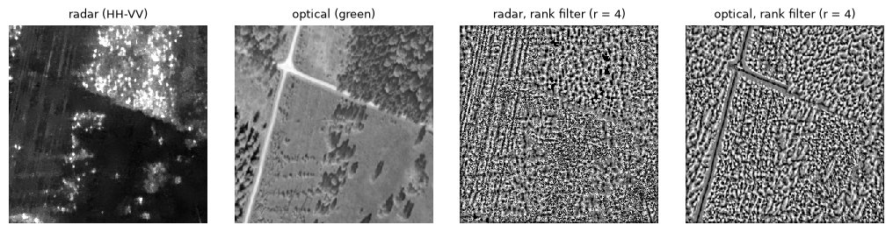
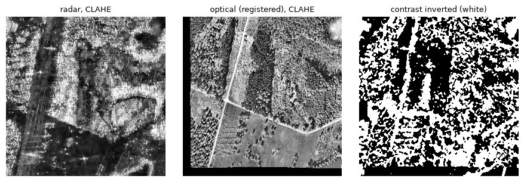
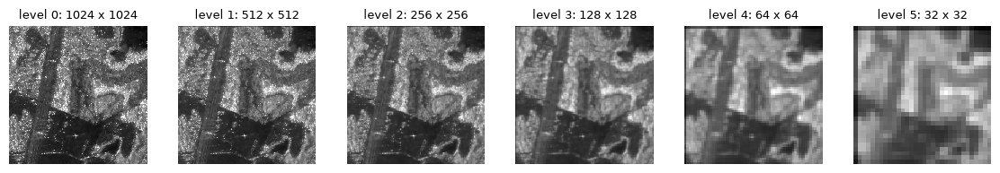
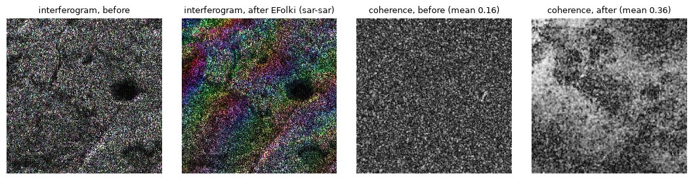
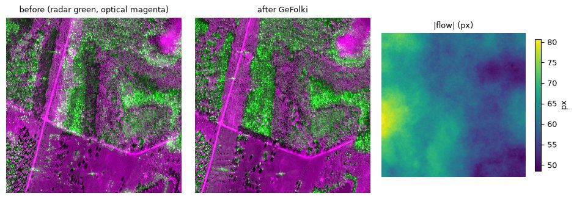
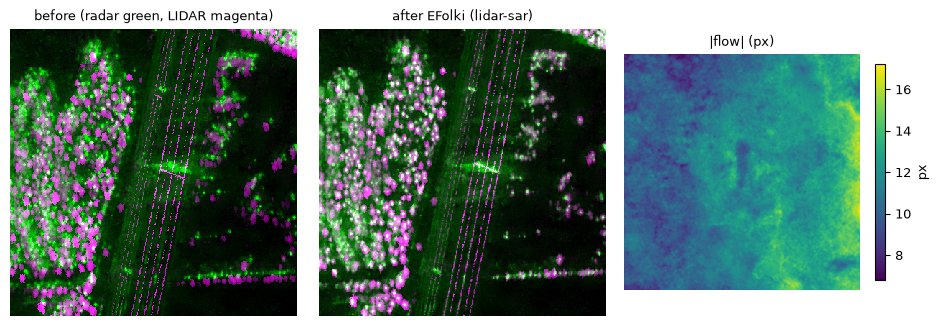
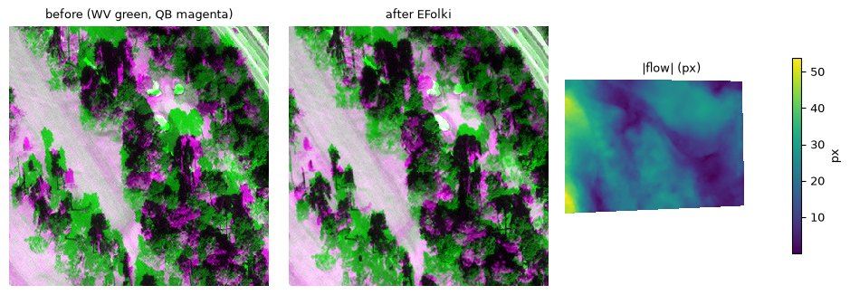
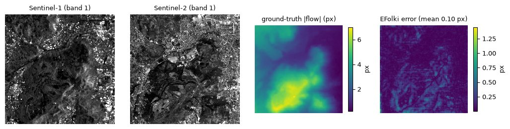

# Coregistration with GeFolki

GeFolki is a general tool for coregistering remote sensing images: SAR, optical, LIDAR,
hyperspectral, in any pairing. This page covers:

1. [The steps of coregistration](#1-the-steps-of-coregistration)
2. [How GeFolki works](#2-how-gefolki-works) and where it sits among other methods
3. [Choosing the parameters](#3-choosing-the-parameters)
4. [Worked examples](#4-worked-examples)
5. [Exercises](#5-exercises) on the sample data

It replaces the ONERA course slides *On the effective use of GeFolki: the swiss army
knife for co-registration of remote sensing images* (E. Koeniguer). All figures are
regenerated from the [sample datasets](../datasets/README.md) with the current package
by [`figures/make_figures.py`](figures/make_figures.py). For the API and command line,
see the [user guide](user-guide.md).

## 1. The steps of coregistration



GeFolki is the flow estimation box. Around it:

### Initialisation

Initialisation brings the slave onto the master grid, roughly. The better the
initialisation, the easier the flow estimation. Typical cases, from the most to the least
prepared input:

| slave image | initialisation | needs |
|---|---|---|
| ground-range product (GRD SAR, orthophoto) | resample to the master pixel size | a ground-projected product |
| SAR SLC with auxiliary data | geocoding | DEM, trajectories, processing software |
| SAR SLC without auxiliary data | control points and a global transform | an operator |
| SAR SLC, rough only | swap or flip the azimuth and range axes into (x, y) | heading and incidence, roughly |

The [user guide](user-guide.md#step-1-initialisation) shows each case in Python.
`gefolki.register()` handles georeferenced inputs on its own, and `gefolki.locate()`
finds a small image inside a large one.

### Flow estimation

Two families of methods estimate the displacement between images:

- **Feature-based**: detect points (corners, SIFT, SURF, ...) in each image, match them
  and fit a transform. Sparse, and needs features that look alike in both images.
- **Dense flow**: estimate a displacement for every pixel. GeFolki belongs here.

### Resampling

Resampling interpolates the slave at the new positions: nearest neighbour (keeps original
values, for class maps), bilinear (the default) or cubic (sharper, may overshoot).
`gefolki.warp(..., order=0|1|3)` and `--resampling nearest|bilinear|cubic`.

For complex SAR images (SLC), the spectra should be centred before interpolation,
and zero-padding (oversampling) helps; do this before `warp` if the phase matters.

### Validation

Check the result by eye, by putting both images on one display:



- **Colour composite**: master in green, slave in magenta; aligned structures turn grey.
- **Checkerboard**: alternating tiles of each image; edges should run across tile borders.
- **Swipe or blink**: switch between the two images (in QGIS, the *MapSwipe* plugin or
  layer toggling); misregistration shows as movement.

For a number, use control points not used in the estimation, or a known flow as in
[EvalGeFolki](#accuracy-on-evalgefolki).

## 2. How GeFolki works

### Why GeFolki

Remote sensing produces more and more images from more and more sensors, at higher
resolution and in long time series. Applications need sub-pixel alignment and fast
processing. GeFolki builds on ONERA's work in computer vision:

| year | method | authors | contribution |
|---|---|---|---|
| 2005 | Folki | F. Champagnat, G. Le Besnerais | iterative, multi-scale Lucas-Kanade dense flow |
| 2013 | eFolki | A. Plyer | rank filter, parallel GPU implementation |
| 2014 | GeFolki (SAR) | A. Plyer, E. Colin-Koeniguer, F. Weissgerber | SAR/SAR interferometry |
| 2015–16 | GeFolki (heterogeneous) | G. Brigot, E. Colin-Koeniguer, A. Plyer, F. Janez | contrast inversion; optical/SAR, LIDAR/SAR |

### Optical flow

The flow `u(x)` is the displacement of each pixel between two images. Optical flow
methods rest on two assumptions:

- **brightness constancy**: a point looks the same in both images,
  `I1(x) ≈ I2(x + u)`;
- **small motion**: points move little, so `I2(x + u) ≈ I2(x) + ∇I2 · u`.

Together they give the optical flow equation `I2(x) − I1(x) + ∇I2 · u = 0`: one equation,
two unknowns per pixel. Methods add a constraint to solve it:

- **local** methods (Lucas-Kanade) assume the flow is constant within a small window;
- **global** methods (Horn-Schunck) add a smoothness term over the whole image.

GeFolki is a local, Lucas-Kanade method. At each pixel `x` it minimises over a window `S`
of radius `r`:

```
J(u; x) = Σ_{x' ∈ S} w(x' − x) · ( I1(x') − I2(x' + u(x)) )²
```

The solver linearises `I2` around the current estimate, solves the 2x2 least-squares
system at every pixel, warps the slave by the new flow and repeats (`iterations` times).
The window sums are box filters, so the cost per pixel does not depend on the radius and
everything runs in parallel, on CPU threads or a GPU.

### Why remote sensing breaks the assumptions

Between two remote sensing images, both assumptions fail:

- **brightness constancy**: a SAR image and an optical image of the same forest share
  structures but not brightness; some areas are even reversed (dark water in SAR, bright
  in some optical bands; dense canopy bright in LIDAR height, dark in SAR shadows);
- **small motion**: after initialisation, residual shifts can reach tens of pixels.

GeFolki replaces the images by transforms that do match, `f1(I1) ≈ f2(I2)`, and uses a
pyramid for large shifts:

- `f1 = R` : rank filter of the master
- `f2 = R ∘ g` : rank filter of the slave, after a local contrast-inversion decision `g`

(The original work also applied an edge-preserving pre-filter, the rolling guidance
filter, before `R`. The package does not; see
[pre-processing](#texture-and-pre-processing).)

### Rank filter

The rank filter replaces each pixel by the number of its `(2·rank + 1)²` neighbours that
are brighter than it. Any monotonic (increasing) change of brightness leaves it unchanged,
so two sensors with different radiometry but the same structures give similar rank images.



### Contrast inversion

Where one image is bright and the other dark, the rank of the slave must be reversed: the
count of *darker* neighbours instead of brighter ones. GeFolki decides this per pixel.
Both images are first equalised with CLAHE (contrast-limited adaptive histogram
equalisation, 8x8 tiles), giving `H0` and `H1` in [0, 1]. Around each pixel `x0`, over a
window `w` of radius `rank`:

```
C1(x0) = Σ_{i ∈ w} | H0(i) − H1(i) |        distance to the line y = x   (same contrast)
C2(x0) = Σ_{i ∈ w} | 1 − H0(i) − H1(i) |    distance to the line y = 1 − x (inverted)
```

If `C1 > C2` the slave is treated as inverted at `x0`, and its inverted rank image is used
there. The decision is made at every iteration, on the slave warped by the current flow.



### Large displacements: the pyramid

Both images are reduced into a Gaussian (Burt) pyramid, halving the size at each level.
The flow is estimated on the coarsest level first, where shifts are small, then
upsampled (bilinear, values doubled) to start the next finer level, down to full
resolution. At every level the solver runs all radii, large to small.



## 3. Choosing the parameters

Parameters, in order of importance:

1. the **initialisation** and the **band** used from each image;
2. whether to test for **contrast inversion**;
3. the **number of levels** `L` and the **window radius** `r`;
4. the **rank** radius and the number of **iterations**.

### Band choice

Use the bands that look most alike: the closest wavelengths between two optical or
hyperspectral sensors, the sum of the bands that cover a panchromatic band, or, for SAR,
the polarisation that best matches the other sensor. `--master-bands` / `--slave-bands`
select bands by index, wavelength range or RGB luminance (see the
[user guide](user-guide.md#choosing-bands)).

### Contrast inversion

On (`gefolki`, `optical-sar`) for heterogeneous pairs where contrast can reverse: SAR vs
optical, different SAR bands. Off (`efolki`) for homogeneous pairs (SAR interferometry,
optical/optical) and where it only adds noise: on the airborne hyperspectral to RGB case
behind the `hyperspectral-rgb` preset, EFolki matched better than GeFolki.

### Pyramid levels

The simplest to set. Estimate the largest shift `D` that remains after initialisation and
take the smallest `L` with `2^L > D`. This is a safe bound: each level also searches
within the window, so fewer levels often suffice (here, 4 levels for a 40 px shift).


Too many levels cost little time but can let a coarse level lock on the wrong structure
when the images are small or repetitive.

### Window radius

A trade-off:

- **large** radius: structures are recognised, but the flow approaches a global
  transform;
- **small** radius: follows local deformations, but may confuse similar structures.

A decreasing list of radii (e.g. 32 to 8 in steps of 4) gives both. The figure shows the
column shift with radius 32 only (smooth), 32 to 8 (detail where the images support it)
and 8 only (lost):


For speckled SAR images, prefer larger radii. Fine local deformations between images of
the same instrument may need small ones: radius 4 was needed for airborne VNIR/SWIR
images.

### Rank and iterations

Of less importance. `rank = 4` (9x9 window) works in most cases. Iterations: typically
8 to 12 for optical images, fewer (2 to 4) for SAR images.

### Texture and pre-processing

When textures differ a lot between the images, the chance of false matches rises,
especially with a small radius and many levels. Then:

- filter the images first (rolling guidance filter, non-local means, NL-SAR for SAR
  speckle) and pass the filtered images to `estimate_flow`;
- increase the radius, especially for SAR.

### Summary

| case | method | levels | radius | iterations | preset |
|---|---|---|---|---|---|
| SAR/SAR, same band (interferometry) | efolki | from `D` (often 3) | large (32) | 2–4 | `sar-sar` |
| LIDAR/SAR | efolki | 6 | 32 → 8 | 2 | `lidar-sar` |
| optical/SAR | gefolki | 6 | 32 → 8 | 2 | `optical-sar` |
| optical/optical | efolki | 5 | 16, 8 | 4–12 | `optical-optical` |
| hyperspectral line / RGB ortho | efolki | 5 | 32, 24, 16, 8 | 2 | `hyperspectral-rgb` |

## 4. Worked examples

GeFolki is:

- **generic**: optical (stereo), radar (interferometry), LIDAR, hyperspectral;
- **self-sufficient**: it needs no auxiliary data (no DEM, no orbits);
- **fast**: designed for video, it runs on GPUs (seconds for a 2048² pair on a CPU,
  fractions of a second on a GPU, see [performance](implementation.md#performance));
- **non-parametric**: no feature selection and no global transform model;
- **dense**: a displacement for every pixel, suited to very high resolution.

### SAR/SAR: interferometry

Interferometry needs sub-pixel alignment: a residual shift of a fraction of a resolution
cell destroys the coherence. GeFolki aligns SLC pairs from their amplitudes alone,
without orbits, DEM or tie points. Published results include airborne SETHI P- and
L-band pairs over forest (2010) and TerraSAR-X / TanDEM-X pairs over cities (stripmap
and spotlight, different resolutions, temporal baselines from 11 days to 4 years).

Below, an L-band HH pair from the sample data. The flow is estimated on the amplitudes
(`sar-sar` preset) and both complex parts of the slave are warped. The interferogram
(hue: phase; saturation: coherence; brightness: amplitude) shows fringes only after
registration, and the mean coherence more than doubles.



### Optical/SAR

Airborne P-band SAR (SETHI, Pauli) against an optical orthophoto resampled into the radar
geometry from geocoding only. Geocoding leaves shifts of 50 to 80 px here; GeFolki,
with contrast adaptation, aligns the roads and forest edges:



### LIDAR/SAR

Tree crowns in a LIDAR canopy model and in SAR do not sit at the same place: the radar
sees the trunk-ground double bounce and the crown at different ranges, and shadows behind
trees. Choose the polarisation where trees appear most like the LIDAR image (HH−VV, the
red channel of the Pauli image). EFolki without contrast inversion (`lidar-sar`) then
aligns individual trees:



In Brigot et al. (2016), over several hundred trees, GeFolki brought the mean position
error from about 10 px with the best geocoding to about 2 px: five times more precise,
without auxiliary data.

### Optical/optical

QuickBird and WorldView panchromatic images over San Francisco, pre-registered by an
affine transform on manual control points. EFolki removes the remaining local shifts
(buildings, relief):



### Hyperspectral

Between the VNIR and SWIR sensors of one airborne instrument (ONERA Hypex, VNIR 1 m, SWIR
2 m), choose the closest bands of the two ranges. Against a panchromatic image (SPOT),
average the hyperspectral bands that fall within the panchromatic band.

`register()` does this for airborne hyperspectral flight lines and an RGB orthomosaic:
it averages the slave bands in 500–600 nm, takes the RGB luminance of the master and uses
the `hyperspectral-rgb` preset. On FX10 lines (224 bands, 0.4 m) against a 2.4 cm RGB
ortho, the residual shift fell to 0.05 px, against 1.1 px for the reference product
registered with ENVI. See
[`examples/register_hyperspectral.py`](../examples/register_hyperspectral.py).

### Accuracy on EvalGeFolki

The EvalGeFolki patches come with a known flow. Warping an image by that flow and
estimating it back gives the end-point error (EPE): the mean distance between estimated
and true displacements. On the Sentinel-1 patch, EFolki recovers a flow of up to 7 px
with a mean error of 0.10 px:



The tests check these errors on every change (`tests/test_flow.py`).

### Conclusion

- Optical flow can coregister remote sensing images, of the same or different kinds.
- On heterogeneous images it is more precise than fine geocoding (five times, on trees).
- It is faster than approaches based on mutual information: about 10 times on a CPU and
  up to 1000 times with a GPU, as reported in the original work.
- It needs no auxiliary data.

Open questions in the original work: automatic choice of the parameters, and use of
several bands at once.

## 5. Exercises

Download the data first: `python datasets/fetch.py` (about 160 MB). Run the code from
the repository root. Extra packages: `pip install matplotlib` (and `tifffile` for
exercise 6). Helpers used below:

```python
import numpy as np
import rasterio
import matplotlib.pyplot as plt
import gefolki as g


def read(path, band=1):
    with rasterio.open(path) as ds:
        return ds.read(band).astype(np.float32)


def fuse(master, slave):
    """Green master, magenta slave: aligned structures look grey."""

    def s(a):
        lo, hi = np.percentile(a, (1, 99))
        return np.clip((a - lo) / (hi - lo), 0, 1)

    return np.dstack([s(slave), s(master), s(slave)])


def show(*images):
    fig, axes = plt.subplots(1, len(images), figsize=(5 * len(images), 5))
    for ax, im in zip(np.atleast_1d(axes), images):
        ax.imshow(im, cmap="gray")
        ax.axis("off")
    plt.show()
```

### Exercise 1: optical/optical (WorldView, QuickBird)

```python
wv, qb = read("datasets/WV.tif"), read("datasets/QB.tif")
mask = wv > 0
u, v = g.efolki(wv, qb, mask=mask, levels=5, radius=(16, 8), iterations=4)
qb_reg = g.warp(qb, u, v)
crop = np.s_[600:1100, 1000:1500]
show(fuse(wv[crop], qb[crop]), fuse(wv[crop], qb_reg[crop]), np.hypot(u, v))
```

Try more iterations (8, 12), a single radius, and `g.gefolki` instead of `g.efolki`.

### Exercise 2: LIDAR/SAR (TopEye, SETHI)

```python
radar = read("datasets/radar_bandep.png", 1)  # Pauli red: HH-VV
lidar = read("datasets/lidar_georef.png")
u, v = g.estimate_flow(radar, lidar, g.PRESETS["lidar-sar"])
show(fuse(radar, lidar), fuse(radar, g.warp(lidar, u, v)))
```

Compare bands 2 (HV+VH) and 3 (HH+VV) of the radar image. Which one looks most like the
LIDAR image, and which gives the best alignment?

### Exercise 3: optical/SAR (orthophoto, SETHI)

```python
optical = read("datasets/optiquehr_georef.png", 2)  # green
u, v = g.gefolki(radar, optical)
show(fuse(radar, optical), fuse(radar, g.warp(optical, u, v)))
```

Run `g.efolki` on the same pair and compare: where does the contrast inversion matter?

### Exercise 4: SAR/SAR interferometry

```python
from scipy.io import loadmat
from scipy.ndimage import uniform_filter

s1 = loadmat("datasets/radar_bandel_hh1.mat")["Radar_bandeL_HH1"]  # complex SLC
s2 = loadmat("datasets/radar_bandel_hh2.mat")["Radar_bandeL_HH2"]
u, v = g.estimate_flow(np.abs(s1), np.abs(s2), g.PRESETS["sar-sar"])
s2_reg = g.warp(s2.real.astype(np.float32), u, v) + 1j * g.warp(s2.imag.astype(np.float32), u, v)


def coherence(a, b, n=7):
    i = a * np.conj(b)
    num = np.abs(uniform_filter(i.real, n) + 1j * uniform_filter(i.imag, n))
    den = np.sqrt(uniform_filter(np.abs(a) ** 2, n) * uniform_filter(np.abs(b) ** 2, n))
    return num / den


print("mean coherence before", coherence(s1, s2).mean(), "after", coherence(s1, s2_reg).mean())
show(np.angle(s1 * np.conj(s2)), np.angle(s1 * np.conj(s2_reg)))
```

### Exercise 5: locate an airborne image in a satellite scene

A Ku-band airborne SAR image (Sandia) lies somewhere in a Sentinel-1 scene. Find it and cut
the matching window:

```python
hit = g.locate_raster(
    "datasets/S1_Jacksonville_GEE.tif",
    "datasets/JacksonvilleNavalAirStation_sandiaKu.png",
    chip_output="match.tif",
)
print(hit.row, hit.col, hit.map_bounds)
```

or `gefolki locate datasets/S1_Jacksonville_GEE.tif datasets/JacksonvilleNavalAirStation_sandiaKu.png --chip-output match.tif`.
The same pair exists over Washington DC (`S1_Washington_GEE.tif`,
`WhashingtonDC_sandiaKu_project.png`).

### Exercise 6: measure the accuracy

```python
import tifffile

master = read("datasets/EvalGeFolki/S1S2/S1_patch11.tif")
gt = tifffile.imread("datasets/EvalGeFolki/S1S2/Flow_patch11.tif")  # (H, W, 2)
slave = g.warp(master, gt[..., 0], gt[..., 1])  # slave(x) = master(x + gt)
u, v = g.efolki(master, slave, levels=3, radius=(16, 8), iterations=4)
epe = np.hypot(u + gt[..., 0], v + gt[..., 1])[30:-30, 30:-30].mean()
print(f"mean end-point error {epe:.3f} px")  # the estimate should be -gt
```

How do levels, radius and iterations change the error? Repeat on the `HR` patch.

## Common errors

- Images that do not cover the same area: mark the uncovered parts invalid in both
  images (`mask=`, or nodata in files), never leave arbitrary values there.
- NaN values: `gefolki` treats them as invalid, but other tools in your chain may not.
- Images not initialised: residual shifts beyond the pyramid's reach give a wrong flow
  everywhere. Check the composite before and after.

## References

- G. Brigot, E. Colin-Koeniguer, A. Plyer, F. Janez, "Adaptation and evaluation of an
  optical flow method applied to coregistration of forest remote sensing images",
  *IEEE JSTARS*, 9(7), 2016.
- A. Plyer, E. Colin-Koeniguer, F. Weissgerber, "A new coregistration algorithm for recent
  applications on urban SAR images", *IEEE GRSL*, 12(11):2198–2202, 2015.
- A. Plyer, G. Le Besnerais, F. Champagnat, "Massively parallel Lucas Kanade optical flow
  for real-time video processing applications", *Journal of Real-Time Image Processing*,
  11(4):713–730, 2016.
- F. Champagnat, A. Plyer, G. Le Besnerais, B. Leclaire, Y. Le Sant, "How to calculate
  dense PIV vector fields at video rate", *8th International Symposium on Particle Image
  Velocimetry*, 2009.
- B. D. Lucas, T. Kanade, "An iterative image registration technique with an application
  to stereo vision", *IJCAI*, 1981.
- B. K. P. Horn, B. G. Schunck, "Determining optical flow", *Artificial Intelligence*,
  17:185–203, 1981.
