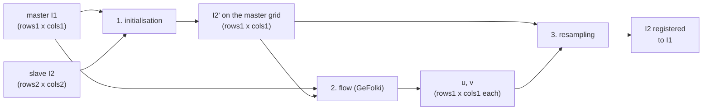
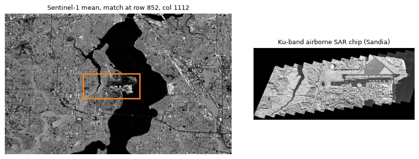
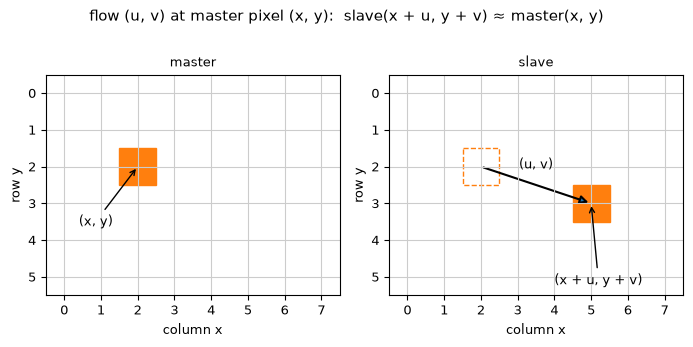
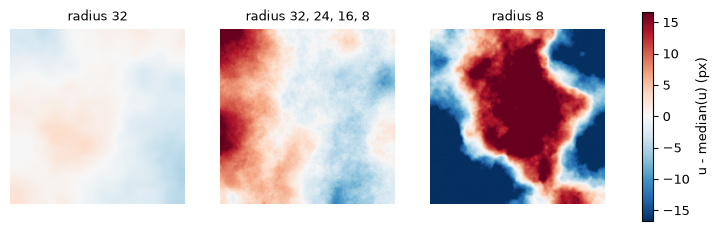
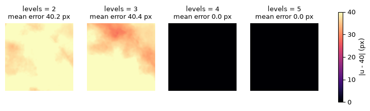

# User guide

How to coregister two remote sensing images with `gefolki`: the three steps of the
process, what each parameter does and how to call the library and the command line.
This guide replaces the original *GeFolki instruction manual* (E. Koeniguer, ONERA,
December 2016), rewritten for the current Python package. For the background
(optical flow, rank filter, contrast inversion) and case studies see
[Coregistration with GeFolki](coregistration.md).

## Licence and citation

GeFolki is distributed under the GNU GPL, version 3 or later. If you use it in a
publication, please cite:

- **Homogeneous images** (same part of the spectrum, e.g. SAR/SAR in one band,
  optical/optical in one channel, even at different resolutions):
  A. Plyer, E. Colin-Koeniguer, F. Weissgerber, "A new coregistration algorithm for recent
  applications on urban SAR images", *IEEE Geoscience and Remote Sensing Letters*,
  12(11):2198–2202, 2015.
- **Heterogeneous images** (SAR/LIDAR, X-band/L-band SAR, SAR/optical, two optical bands,
  etc.): G. Brigot, E. Colin-Koeniguer, A. Plyer, F. Janez, "Adaptation and evaluation of
  an optical flow method applied to coregistration of forest remote sensing images",
  *IEEE Journal of Selected Topics in Applied Earth Observations and Remote Sensing*,
  9(7), 2016.

See the [main README](../README.md#citation) for references on measurement and computer
vision uses.

## Overview: three steps

Pixel matching of two images splits into three steps:



1. **Initialisation** takes two images of any size and brings the slave roughly into the
   master's geometry: same pixel size, same number of rows and columns.
2. **Flow estimation** (GeFolki) takes two images of equal shape and returns a dense flow:
   a column shift `u` and a row shift `v` for every master pixel.
3. **Resampling** warps the slave by the flow, so that it lies on top of the master.

`I1` is the *master* (reference) and `I2` the *slave* (the image to move) throughout.

`gefolki.register()` and `gefolki register` run all three steps on georeferenced files.
`gefolki.estimate_flow()` (step 2) and `gefolki.warp()` (step 3) work on NumPy arrays you
have already initialised.

## Step 1: initialisation

The flow step needs two images of the same shape that already overlap roughly: residual
shifts should be within the reach of the pyramid (see [levels](#levels)). How you get
there depends on how the images were acquired.

**Same acquisition geometry** (two SAR images in interferometric conditions, VNIR and
SWIR from one sensor): a crop or a shift is enough; the slave is not resampled.

**Georeferenced images** (GeoTIFF, COG, ENVI with map information): `register()` does
the initialisation for you. It reads the master *resampled onto the slave grid* (using
overviews, averaging when downsampling), so the master can be far larger than memory and
in another CRS or resolution. The flow and output then live on the slave grid. To do it
by hand, use `gdalwarp` or `rasterio.warp.reproject`.

**Simple transform** (scale only, or a known rotation): resample with scikit-image.

```python
from skimage.transform import resize, rotate

slave_init = resize(slave, master.shape, order=1, preserve_range=True)
slave_init = rotate(slave_init, angle=12.5, order=1, preserve_range=True)  # degrees, CCW
```

**Control points** (no georeferencing, or georeferencing too poor): pick matching points
in both images (QGIS Georeferencer, or any viewer), fit a global transform and warp the
slave onto the master grid.

```python
import numpy as np
from skimage.transform import estimate_transform, warp as sk_warp

# (x = column, y = row) of the same features in each image
master_pts = np.array([[105, 40], [880, 62], [510, 700], [90, 650]], float)
slave_pts = np.array([[130, 22], [905, 70], [520, 690], [95, 640]], float)

tform = estimate_transform("affine", master_pts, slave_pts)  # or "projective"
slave_init = sk_warp(slave, tform, output_shape=master.shape, order=1, preserve_range=True, cval=0)
mask = sk_warp(np.ones(slave.shape), tform, output_shape=master.shape, order=0) > 0
```

**Unknown position** (a small airborne chip somewhere in a satellite scene):
`gefolki.locate()` finds where the chip lies, then crop the master to the match.

```python
hit = g.locate_raster("S1_Jacksonville_GEE.tif", "chip.png", chip_output="match.tif")
print(hit.row, hit.col, hit.map_bounds)  # chip's top-left in master pixels; map extent
```



**Geocoding from sensor models** (latitude/longitude grids from trajectories and a DEM)
is specific to each sensor and outside the scope of `gefolki`.

Areas that only one image covers must be marked invalid, not filled with arbitrary
values: pass a `mask` (or nodata in files), see [masks and nodata](#masks-and-nodata).

### Pixel coordinates

`gefolki` uses NumPy order: an image is indexed `image[row, col]`, `x` is the column and
`y` the row, both from 0. (The Matlab manual used `[Y, X] = meshgrid(1:ny, 1:nx)` with
`X` the row and `Y` the column, from 1.) The equivalent grids in NumPy:

```python
rows, cols = np.mgrid[0:h, 0:w]  # rows[i, j] = i, cols[i, j] = j
```

## Step 2: flow estimation



The flow maps each master pixel to its match in the slave:

```
slave(x + u, y + v) ≈ master(x, y)
```

`u` is the column (x) shift and `v` the row (y) shift, in pixels, both arrays of the
master's shape. If the slave is the master moved right by `d` pixels
(`slave(x) = master(x - d)`), then `u = +d`.

```python
import gefolki as g

u, v = g.gefolki(master, slave)  # heterogeneous pair (default)
u, v = g.efolki(master, slave)  # no contrast inversion test
u, v = g.folki(master, slave)  # raw intensities, no rank filter
u, v = g.gefolki(
    master, slave, levels=5, radius=(32, 16, 8), iterations=4, rank=4, mask=valid, device="gpu"
)

p = g.FlowParams(levels=6, radius=(32, 24, 16, 8), iterations=2, rank=4, contrast_adapt=True)
u, v = g.estimate_flow(master, slave, p, mask=valid, device="auto", threads=8)
```

Inputs are 2-D arrays of equal shape and any numeric dtype; each is scaled to [0, 1] over
its valid pixels. NaN and infinite values count as invalid. Outputs are float32 NumPy
arrays (`return_device=True` keeps CuPy arrays on the GPU).

The legacy Matlab code returned one array `W` of shape `(rows, cols, 2)` with `W(:,:,1)`
the column shift and `W(:,:,2)` the row shift; `np.dstack([u, v])` gives the same layout.

### Parameters

| parameter | `FlowParams` / CLI | default | role |
|---|---|---|---|
| window radius | `radius` / `--radius` | 32, 28, ..., 8 | half-size `r` of the `(2r+1)²` window over which the two images must match; a decreasing list runs large to small |
| pyramid levels | `levels` / `--levels` | 6 | number of halvings; bounds the largest shift found |
| iterations | `iterations` / `--iterations` | 2 | solver iterations per radius and level |
| rank | `rank` / `--rank` | 4 | rank filter radius (`(2·4+1)² = 9x9` window); 0 uses raw intensities |
| contrast adaptation | `contrast_adapt` / `--contrast-adapt` | on for `gefolki` | test for local contrast inversion between the images |

#### Radius

The radius sets the window on which the two images must look alike. It is a trade-off:

- a **large** radius is robust: it recognises large structures and finds a global shift,
  but smooths out local deformations;
- a **small** radius follows deformations that change quickly across the image, but
  confuses similar structures more easily.

Running several radii from large to small, at every level, combines both. A small radius
used alone (right) loses its way:



#### Levels

Each pyramid level halves the images, so a shift of `D` pixels becomes `D / 2^L` at the
coarsest level `L`. The manual's rule: choose the smallest `L` with `2^L > D`. The rule is
safe rather than tight, since the window radius also adds reach at each level: below, a
40 px shift with radii 16 and 8 is found from `levels=4` (`2^4 = 16`).



`gefolki` lowers `levels` if the coarsest image would drop below 2 px.

#### Iterations

Number of linearised least-squares updates per radius and level. Usually 2
to 10: 2 to 4 for SAR, more (8 to 12) for optical images with fine detail.

#### Contrast adaptation

Looks for areas where one image is bright where the other is dark (water in SAR vs
optical, shadows, forest in LIDAR vs SAR) and inverts the slave there. Turn it **on** for
heterogeneous pairs (`gefolki`, `--method gefolki`, presets `optical-sar`) and **off** for
homogeneous ones (SAR interferometry, optical/optical: `efolki`).

#### Rank

The rank filter replaces each pixel by the number of its neighbours that are brighter.
This removes any monotonic difference in brightness between sensors. 4 (9x9 window) suits
most cases.

### Presets

| preset | levels | radius | iterations | rank | contrast adaptation |
|---|---|---|---|---|---|
| `hyperspectral-rgb` | 5 | 32, 24, 16, 8 | 2 | 4 | off |
| `sar-sar` | 3 | 32 | 2 | 4 | off |
| `lidar-sar` | 6 | 32, 28, ..., 8 | 2 | 4 | off |
| `optical-sar` | 6 | 32, 28, ..., 8 | 2 | 4 | on |
| `optical-optical` | 5 | 16, 8 | 4 | 4 | off |

```python
u, v = g.estimate_flow(master, slave, g.PRESETS["optical-sar"])
```

`register()` and the CLI take `preset=` / `--preset`. Without a preset or explicit
parameters they use the defaults above with contrast adaptation on, except for an RGB
master with a hyperspectral slave, where `hyperspectral-rgb` is chosen. `method=` /
`--method` then switches only the variant: `folki` (rank 0, no contrast adaptation),
`efolki` (rank, no contrast adaptation), `gefolki` (rank and contrast adaptation). On the
command line, `--levels`, `--radius`, `--iterations`, `--rank` and
`--contrast-adapt/--no-contrast-adapt` override single values.

## Step 3: resampling

`warp` samples the slave at `(x + u, y + v)`, giving the slave on the master grid:

```python
registered = g.warp(slave, u, v)  # bilinear
registered = g.warp(slave, u, v, order=0)  # nearest (e.g. class maps)
registered = g.warp(slave, u, v, order=3)  # cubic
stack_reg = g.warp(cube, u, v, nodata=0)  # (bands, rows, cols)
```

Pixels whose sample point falls outside the slave, or touches a slave nodata pixel, get
`nodata` (0 if not given). Integer images are rounded and clipped to their dtype.

Equivalent of the manual's Matlab call
`I3 = interp2(x', y', I2p', x' + W(:,:,2)', y' + W(:,:,1)', 'nearest')'`:

```python
I3 = g.warp(I2p, u, v, order=0)
```

Complex SAR images: warp the real and imaginary parts separately, as in
[the SAR/SAR exercise](coregistration.md#exercise-4-sarsar-interferometry).

## Putting it together

Arrays already on the same grid:

```python
import numpy as np
import rasterio
import gefolki as g

with (
    rasterio.open("datasets/radar_bandep.png") as r,
    rasterio.open("datasets/optiquehr_georef.png") as o,
):
    radar = r.read(1).astype(np.float32)  # HH-VV
    optical = o.read(2).astype(np.float32)  # green

u, v = g.gefolki(radar, optical)
optical_registered = g.warp(optical, u, v)
```

Georeferenced files, one call:

```python
res = g.register(
    "ortho_rgb.tif",
    "sar.tif",
    "sar_registered.tif",
    preset="optical-sar",
    flow_output="flow.tif",
)
print(res.flow_stats, res.timings)
```

`register` reads one band (or a band combination) from each image to estimate the flow,
then warps **every** slave band and writes them with the slave's grid, CRS, dtype, nodata,
band names and wavelengths. The output format follows the suffix (`.tif` GeoTIFF; `.bsq`,
`.bil`, `.img`, `.dat` or none ENVI) or `output_format` (`"GTiff"`, `"COG"`, `"ENVI"`).

The same from the shell:

```bash
gefolki register ortho_rgb.tif sar.tif sar_registered.tif --preset optical-sar \
    --flow-output flow.tif
```

Or in two steps, to check the flow before warping, or to apply one flow to other rasters
on the same grid:

```bash
gefolki flow ortho_rgb.tif sar.tif flow.tif --preset optical-sar --json
gefolki warp sar.tif flow.tif sar_registered.tif --resampling cubic
```

The flow file is a 2-band float32 GeoTIFF on the slave grid: band 1 `u`, band 2 `v`, in
pixels.

### Choosing bands

`register`, `flow` and `estimate_raster_flow` estimate the flow on one 2-D image per
input, chosen with `master_bands` / `slave_bands` (`--master-bands` / `--slave-bands`):

| spec | meaning |
|---|---|
| `1` or `"1"` | band 1 (1-based, as in GDAL) |
| `"1,2,3"` or `[1, 2, 3]` | mean of those bands |
| `"500-600"` | mean of the bands with a wavelength in 500–600 nm (needs wavelength metadata) |
| `"rgb-gray"` | luminance 0.299 R + 0.587 G + 0.114 B of an RGB(A) raster |

Default: `"rgb-gray"` for an RGB master, else band 1; `"500-600"` for a slave with
wavelengths when the master is RGB, else band 1. Pick bands that look alike: the closest
wavelengths between two optical sensors, or the polarisation that best matches the other
sensor (HH-VV for SAR against LIDAR canopy height).

## Masks and nodata

- **Arrays**: pass `mask=` (True = valid) to `estimate_flow` and its wrappers. NaN and
  infinite pixels are invalid too. Invalid pixels are set to 0 in *both* images before
  estimation, so no-data borders do not create false edges.
- **Files**: the nodata value, alpha band or dataset mask of each raster defines its valid
  pixels; areas outside the other image's footprint are invalid as well.
- **Output**: warped pixels that come from outside the slave or from slave nodata get the
  slave's nodata value.

The two most common errors with the original code were: (1) images that do not cover the
same area without a shared zero mask, and (2) NaN values in the input. Both are handled
by the masking above; with arrays, still pass a mask where only one image has data.

## Next

- [Coregistration with GeFolki](coregistration.md): how the method works, parameter
  tuning, worked examples and exercises
- [Command line reference](cli.md), [Python API reference](api.md)
- [Implementation notes](implementation.md): backends, GPU, large images, performance
